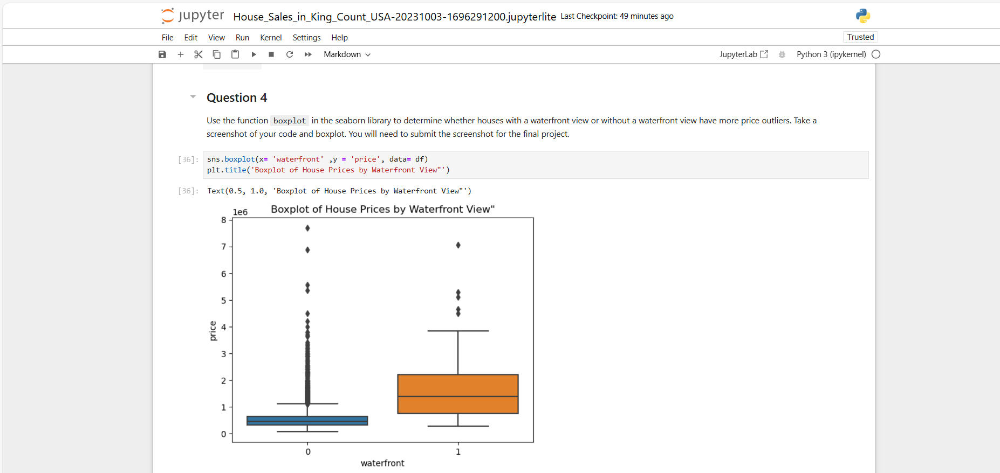
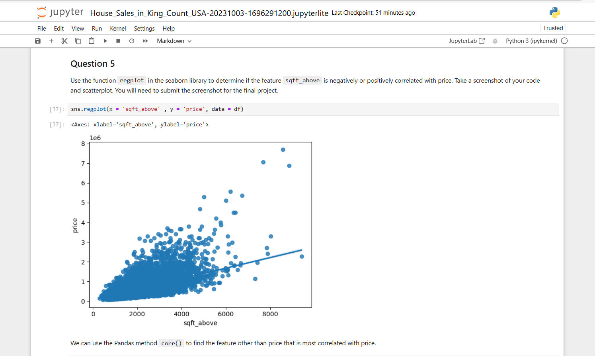

<br><h1 align="center">🏡 House Price Regression Analysis – Final Project</h1>

<p align="center"><i>Built as part of IBM's <b>Data Analysis with Python</b> course under the Skills Network program</i></p><br>

<p align="center">
  <a href="LICENSE">
    
  </a>
  <a href="https://www.python.org/">
    
  </a>
  <a href="https://scikit-learn.org/stable/">
    
  </a>
  <a href="https://github.com/hamaylzahid/house-price-regression-analysis">
    
  </a>
  <a href="https://github.com/hamaylzahid/house-price-regression-analysis/commits">
    
  </a>
  <a href="https://github.com/hamaylzahid/house-price-regression-analysis/stargazers">
    
  </a>
  
</p>
<p > This project is a hands-on application of regression techniques to predict housing prices using real data from  <b>King County, Washington (USA)</b>. It serves as the <b>final project</b> for IBM’s Data Analysis with Python course.

The dataset includes features like square footage, location, number of bedrooms/bathrooms, and more. The goal is simple:  </p>

> 💡 *Can we build accurate models to predict a house's price based on its attributes?*

### 🔍 What’s Inside

- 📊 Exploratory Data Analysis (EDA)
- 🧹 Data Cleaning & Feature Selection
- 📈 Linear and Ridge Regression Models
- 🔁 Polynomial Transformation (2nd order)
- 📉 Model Evaluation using R² Score

This project follows practical data science workflows and showcases clean, interpretable, and well-documented results — ideal for portfolios and real-world problem-solving.


> ⚠️ **Note:** This project is part of the IBM Skills Network curriculum. All rights and acknowledgments belong to **IBM®**.

---

<br><h2 align="center">📌 Features</h2><br>

<ul>
  <li>✅ Real-world dataset from <strong>King County House Sales</strong></li>
  <li>✅ Data preprocessing with <code>pandas</code> & <code>scikit-learn</code></li>
  <li>✅ Exploratory Data Analysis (EDA) with insightful visuals</li>
  <li>✅ Linear & Ridge Regression modeling</li>
  <li>✅ Polynomial feature transformation for non-linear relationships</li>
  <li>✅ Model evaluation using <strong>R² Score</strong></li>
</ul>

---

<br><h2 align="center">📖 Table of Contents</h2><br>

- [🧠 Project Overview](#-project-overview)
- [🎯 Objectives](#-objectives)
- [📊 Dataset Info](#-dataset-info)
- [🛠️ Workflow Breakdown](#️-workflow-breakdown)
- [📈 Metrics & Results](#-metrics--results)
- [📉 Polynomial Ridge Regression](#-polynomial-ridge-regression)
- [⚙️ Setup & Installation](#️-setup--installation)
- [📚 Core Libraries Used](#-core-libraries-used)
- [🙏 Acknowledgments](#-acknowledgments)
- [📜 License](#-license)

---

<br><h2 align="center">🧠 Project Overview</h2><br>

This project delivers a practical and analytical exploration of **house price prediction** using real estate data from **King County, Washington, USA**. It represents the capstone effort of the **Data Analysis with Python** course by IBM, combining core concepts of data wrangling, statistical analysis, and machine learning into a cohesive workflow.

By applying both **linear** and **ridge regression models**, along with **polynomial transformations**, the project investigates how multiple housing features—such as number of bedrooms, square footage, location, and waterfront views—affect property prices.

In addition to predictive modeling, the project emphasizes:
- 📊 Meaningful visualizations to support insights  
- 🧹 Clean data pipelines for reproducibility  
- 📈 Interpretable results using R² scores  
- 🧠 Logical reasoning behind each transformation

> ✅ Whether you're a homeowner, data analyst, or aspiring ML engineer, this project showcases how real-world housing data can inform intelligent decision-making through the power of regression.

---

<br><h2 align="center">🎯 Objectives</h2><br>

- Load and preprocess the dataset using pandas  
- Perform Exploratory Data Analysis (EDA)  
- Build Linear and Ridge regression models  
- Apply Polynomial transformation for second-order effects  
- Evaluate model performance with R² scores  
- Visualize predictions and residuals

---

<br><h2 align="center">📊 Dataset Info</h2><br>

The dataset used in this project contains detailed records of house sales in **King County, Washington, USA**, including Seattle and surrounding areas. It serves as the foundation for building and evaluating regression models to predict housing prices based on various property attributes.

-  **Source**: House Sales in King County, USA  
-  **Records**: `21,613` observations × `21` features  
-  **Target Variable**: `price` – the sale price of each house  
-  **Key Features Include**:
  - `sqft_living`: Living area in square feet  
  - `bedrooms`, `bathrooms`: Number of rooms  
  - `floors`, `waterfront`, `view`, `condition`, `grade`  
> 🗂️ This dataset offers a rich variety of numerical and categorical features, making it ideal for applying regression techniques and exploring real-estate trends.

---

<br><h2 align="center">🛠️ Workflow Breakdown</h2><br>

1. Import libraries and load dataset  
2. Clean data (handle missing values, types)  
3. Visualize feature-target relationships  
4. Prepare features and target variables  
5. Train Linear & Ridge regression models  
6. Apply second-order polynomial transformation  
7. Evaluate and compare results using R²  
8. Visualize residuals and predictions

---

<br><h2 align="center">📈 Metrics & Results</h2><br>

| Model                          | R² Score (Test) |
|-------------------------------|-----------------|
| Linear Regression             | ~0.70           |
| Ridge Regression (α=0.1)      | ~0.71           |
| Polynomial Ridge Regression   | ~0.75+          |

> 📌 *Polynomial regression improved model fit, indicating non-linear feature effects on house pricing.*
---

<br><h2 align="center">📊 Visual Insights</h2><br>

### 🧪 Question 4: Waterfront View vs. Price Outliers (Boxplot) 

<p align="center">
  
  <br>
   <br> <i>Figure 1: Boxplot showing that waterfront properties have more extreme price outliers.</i>
</p>

### 📈 Question 5: Correlation between sqft_above and Price (Regplot)

<br><p align="center">
  
  <br>
  <br>  <i>Figure 2: Regression plot showing a positive correlation between `sqft_above` and `price`.</i>
</p>


---

<br><h2 align="center">📉 Polynomial Ridge Regression</h2><br>

The final step applied a second-order polynomial transform to capture interaction effects among features. Ridge regularization helped avoid overfitting.

```python
from sklearn.linear_model import Ridge
from sklearn.preprocessing import PolynomialFeatures

poly = PolynomialFeatures(degree=2)
x_train_poly = poly.fit_transform(x_train)
x_test_poly = poly.transform(x_test)

ridge = Ridge(alpha=0.1)
ridge.fit(x_train_poly, y_train)

r2 = ridge.score(x_test_poly, y_test)
print("Polynomial Ridge R²:", r2)
```

---

<br><h2 align="center">⚙️ Setup & Installation</h2><br>

```bash
# Optional: create virtual environment
python -m venv venv
source venv/bin/activate  # Windows: venv\Scripts\activate

# Install dependencies
pip install numpy pandas matplotlib seaborn scikit-learn
```

---

<br><h2 align="center">📚 Core Libraries Used</h2><br>

<p align="center">
  
  
  
  
</p>

---
<br><h2 align="center">🙏 Acknowledgments</h2><br>

<p align="center">
  
  
  
</p>

<p align="center">
  This project was completed as part of the <strong>Data Analysis with Python</strong> course offered by <strong>IBM®</strong> through the <strong>Skills Network</strong> platform.
</p>

<p align="center">
  Special thanks to the <strong>course instructors</strong> for their clear explanations and practical examples, and to <strong>IBM Skills Network</strong> for providing a hands-on learning experience with real-world datasets and tools.
</p>

<p align="center">
  Your guidance played a key role in helping me apply data science techniques to solve real analytical problems. 🙌
</p>


---


<br><h2 align="center">🤝 Contact & Contribution</h2><br>

<p align="center">
  <a href="mailto:maylzahid588@gmail.com">
    
  </a>
  <a href="https://www.linkedin.com/in/hamaylzahid/" target="_blank">
    
  </a>
</p>

<p align="center">
  <a href="https://github.com/hamaylzahid/house-price-regression-analysis/stargazers">
    
  </a>
  <a href="https://github.com/hamaylzahid/house-price-regression-analysis/fork">
    
  </a>
</p>

<p align="center">
  Let’s connect and build something amazing together! 🚀
</p>


---

<br><h2 align="center">📜 License</h2><br>

<p align="center">
  <a href="LICENSE"></a>
  <a href="https://github.com/hamaylzahid/house-price-regression-analysis/commits/main">
    
  </a>
  <a href="https://github.com/hamaylzahid/house-price-regression-analysis">
    
  </a>
</p>

<p align="center">
  This project is licensed under the <strong>MIT License</strong> – free to use, modify, and distribute.
</p>

<p align="center">
  ✅ <strong>Project Status:</strong> Completed and ready for portfolio showcase  
  <br>
  🧾 <strong>License:</strong> MIT – <a href="LICENSE">View License »</a>
</p>

 ---

 
<p align="center">
  
  
  
</p>

<p align="center">
  <b>Crafted with purpose & precision</b> 🧠  
</p>

<p align="center">
  <a href="https://github.com/hamaylzahid">
    
  </a>
  •  
  <a href="mailto:maylzahid588@gmail.com">
    
  </a>
  •  
  <a href="https://github.com/hamaylzahid/house-price-regression-analysis">
    
  </a>
  <br>
  <a href="https://github.com/hamaylzahid/house-price-regression-analysis/fork">
    
  </a>
</p>

<p align="center">
  <sub><i>Crafted with curiosity. Powered by data. Built to make insights matter.</i></sub>
</p>

<p align="center">
  🔍 <b>Use this project to amplify your Data Science journey</b>  
  <br>
  📦 Fork it, explore it, refine it — and showcase your ability to turn data into decisions.
</p>

